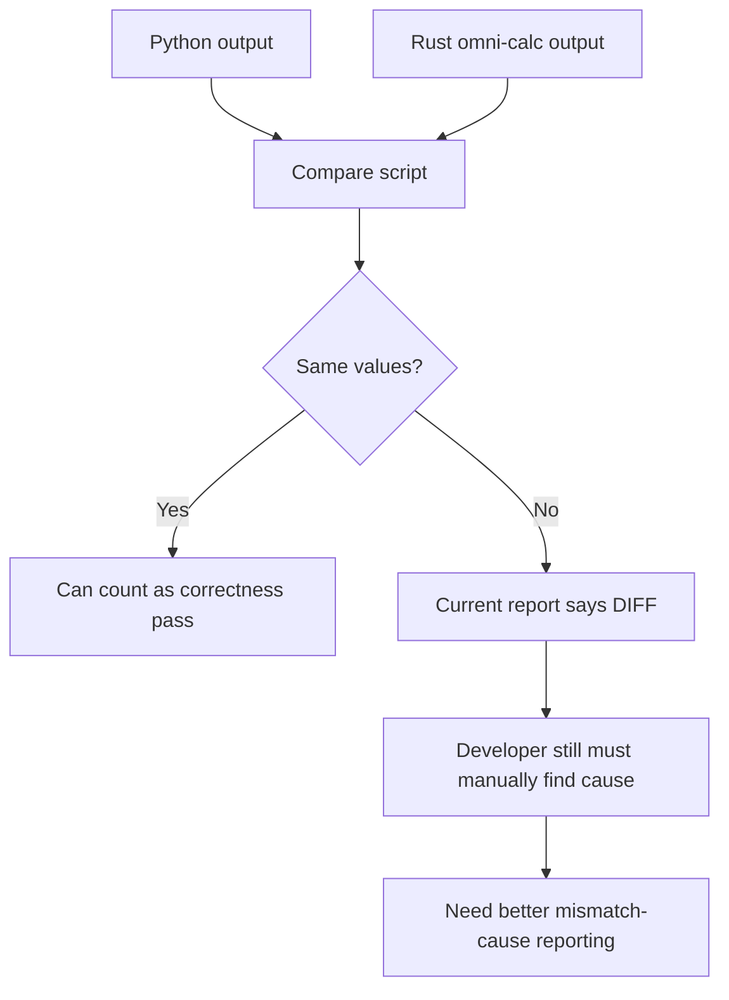

# Rust Omni-Calc Discussion Guide

## 1. Meeting Goal

Use this meeting to agree on the next practical step for Rust omni-calc correctness and compare-script reporting.

The main question is:

```text
How do we make Rust-vs-Python comparison output trustworthy and easy to debug?
```

## 2. Branches In Scope

```text
Older Rust branch:
feature/update-omni-vs-python-compare-script

Newer Rust branch:
codex/BLOX-2143-pr2951-report-flow-resolved-20260511

Performance/tracing option branch:
BLOX-2143-add-omni-calc-runtime-performance-tracing-and-benchmark-baseline
```

## 3. What Changed Across The Branches

### Older branch

- Has the compare script and older Rust execution path.
- Uses older raw formula parsing fallback.
- Already has several real Rust correctness issues around zeros, filters, joins, and missing output materialization.

### Newer branch

- Improves raw formula parsing by using `FormulaParser`.
- Adds newer preload/runtime behavior.
- Changes some connected-dimension and dimension-type property filter behavior.
- Fixes one execution blocker, but creates new value mismatches in some models/blocks.

### Benchmarking/tracing branch

- Adds detailed Rust runtime phase timings.
- Helps explain where Rust spends time.
- Useful for performance debugging.
- Not enough by itself to explain exact value mismatches.

## 4. Simple Flow Of The Problem



## 5. Main Issues To Discuss

### 5.1 Compare script is detecting mismatches, but not explaining them enough

Current output can say a value changed at a DeepDiff path like:

```text
root[2]['total_values'][4]['value']
```

That is not enough for fast debugging.

The output should instead say:

```text
Model 12966, block 25393, indicator "Loans in", May-24:
Python = 300000
Rust = 0
Likely cause = dimension-type property filter behavior changed
Likely code path = filter_utils.rs
```

### 5.2 Some issues are real Rust engine bugs

These can affect actual app-visible values:

- Rust can zero valid raw input values around forecast start.
- Rust can zero all values when actuals time/value lengths do not align.
- Missing filter metadata can become zero output instead of a clear error.
- Property joins use display names instead of stable ids.
- Rust can fail to materialize the requested block dataframe.
- New preload behavior can miss metadata needed at runtime.
- New dimension-type filter behavior can compare the wrong kind of item name.

### 5.3 Some issues are report/script problems

These do not necessarily mean Rust output is wrong:

- Float truncation hides decimal differences.
- Missing rows can be classified as metadata.
- Only the first successful iteration is compared.
- Empty valid responses can be treated as endpoint failures.
- Speedup can include blocks where Rust output is wrong.
- Summary counts under-report real value diffs.

## 6. Biggest Branch-Level Takeaways

### Keep from the newer branch

Keep the `FormulaParser` improvement. It turns at least one old `ERROR` case into an executable Rust path.

Example from the report:

```text
model 14894, block 38360:
older branch = ERROR
newer branch = DIFF
```

This means the newer branch got farther, but values still need fixing.

### Investigate in the newer branch

The newer branch has new diff risk around:

- preload metadata coverage
- bulk property null/missing behavior
- dimension-type property filter semantics

Example blocks called out:

```text
model 12966, block 25393
model 13131, block 26523
model 13318, block 27870
model 14720, block 36488
```

## 7. Recommended Direction

The recommended path is not a full redesign.

Recommended order:

1. Improve compare-script mismatch-cause reporting first.
2. Then add runtime phase timings from the benchmarking branch.
3. Fix the newer branch regressions around preload/filter behavior.
4. Then fix shared Rust engine bugs around zero fallbacks, joins, and materialization.

## 8. Why This Order

### First: mismatch-cause reporting

This gives the fastest debugging value.

It answers:

- What exact value is wrong?
- Which model/block/indicator is affected?
- Which side is likely wrong?
- What code path should we inspect first?

### Second: runtime phase timings

Runtime logs are useful, but mostly for timing and stage-level clues.

They answer:

- Did preload run?
- Did formula eval dominate?
- Did actuals/filter handling take time?
- Did a branch get slower?

They do not directly answer which value is wrong.

## 9. Proposed Compare Script Output

The improved report should include structured mismatch rows like this:

```json
{
  "model_id": 12966,
  "block_id": 25393,
  "indicator_name": "Loans in",
  "period": "May-24",
  "python_value": 300000,
  "rust_value": 0,
  "likely_wrong_side": "rust",
  "confidence": "high",
  "likely_cause": "dimension_type_property_filter_semantics_changed",
  "suspected_code_path": "modelAPI/omni-calc/src/engine/exec/filter_utils.rs"
}
```

This is the main improvement needed for developer productivity.

## 10. Decision Points For Meeting

Discuss and decide:

1. Should we implement direct mismatch-cause reporting first?
2. Which mismatch categories should be supported in the first version?
3. Should speedup exclude blocks that have value mismatches?
4. Should runtime tracing from the benchmark branch be added as a second phase?
5. Should missing metadata in Rust return hard errors instead of zeros?
6. Should connected/property joins move from display names to stable item ids?
7. Which newer branch regression should be fixed first: preload coverage or dimension-type filter semantics?

## 11. Suggested First Implementation Slice

A practical first slice:

```text
Compare script:
  - flatten output by model/block/indicator/period/dimension key
  - use real numeric tolerance
  - classify missing rows as data diffs
  - add likely cause and suspected code path fields
  - separate correctness-passed speedup from raw speedup
```

This should give immediate value without requiring the full runtime tracing design.

## 12. Final Recommendation For Discussion

Agree to build the compare script into a correctness diagnosis tool first.

Then add runtime phase timing as useful context, not as the primary correctness explanation.

In simple terms:

```text
First make the script say what is wrong.
Then make it say where Rust spent time.
```
